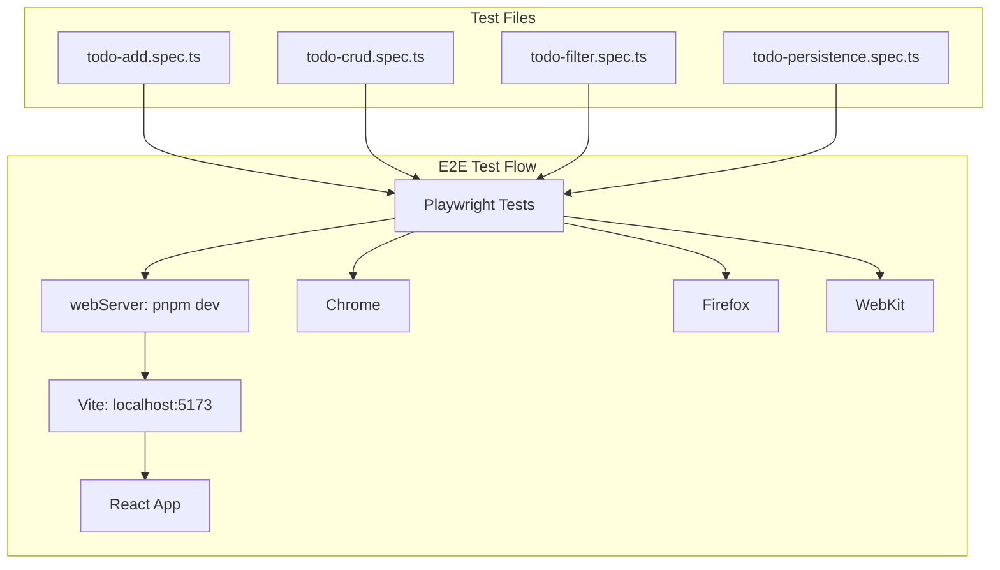

# Creative Phase: Выбор инструмента E2E (Playwright vs Cypress)

**Task ID:** e2e-tests-001  
**Документ:** creative-e2e-tool-selection.md  
**Дата:** 2026-02-11

---

🎨🎨🎨 ENTERING CREATIVE PHASE: ARCHITECTURE / TECHNOLOGY SELECTION 🎨🎨🎨

**Focus:** Выбор E2E-инструмента для pet.todo  
**Objective:** Принять обоснованное решение между Playwright и Cypress с учётом требований проекта  
**Requirements:** Multi-browser, Vite+React, CI/CD, DX, соответствие testing-guidelines.md (русский язык в тестах)

---

## 1. Context

### Системные требования

- **Полный user flow:** добавление → переключение → удаление → фильтрация задач
- **Multi-browser:** Chrome, Firefox, WebKit/Edge — тестирование на разных браузерах
- **Автоматизация критических сценариев** с возможностью CI/CD

### Технические ограничения

- **Стек:** React 19, Vite 7, TypeScript 5.9
- **Unit-тесты:** Vitest + Testing Library (оставить без изменений)
- **Dev-сервер:** `pnpm dev` → `http://localhost:5173`
- **Правила:** `testing-guidelines.md` — русский язык в describe/it, константы из `src/constants/todo.ts`

### Существующие паттерны

- Компоненты используют `aria-label` (TodoInput, TodoFilter, TodoItem)
- Константы: `STORAGE_KEY`, `MAX_TODO_LENGTH`, `FILTER_LABELS`

---

## 2. Options Analysis

### Option 1: Playwright

**Описание:** E2E-фреймворк от Microsoft с нативной поддержкой нескольких браузеров и архитектурой «вне браузера».

| Критерий          | Оценка                                                           |
| ----------------- | ---------------------------------------------------------------- |
| **Vite + React**  | Встроенный `webServer` с командой `pnpm dev` и портом 5173       |
| **Multi-browser** | Chrome, Firefox, WebKit — нативная поддержка, без «experimental» |
| **DX**            | Playwright UI, trace viewer, скриншоты, видео при падении        |
| **Скорость**      | ~26% быстрее в среднем; бесплатный параллельный запуск           |
| **CI/CD**         | Официальные GitHub Actions, JUnit/HTML-отчёты                    |
| **Русский язык**  | TypeScript/JS — произвольные строки в describe/it                |

**Pros:**

- Multi-browser из коробки (Chrome, Firefox, WebKit)
- `webServer` в конфиге — автоматический запуск dev-сервера
- Бесплатный параллельный запуск без облачного плана
- Работает вне браузера — стабильность при крашах приложения
- Перехват запросов, file downloads, cross-origin без хаков
- TypeScript-first, хорошая типизация

**Cons:**

- Более тяжёлая начальная установка (~200MB браузеров)
- Другой API по сравнению с Vitest (describe/test vs Jest-стиль)

**Complexity:** Medium  
**Implementation Time:** 2–3 часа для setup + базовые сценарии

---

### Option 2: Cypress

**Описание:** Популярный E2E-фреймворк с time-travel debugging и выполнением внутри браузера.

| Критерий          | Оценка                                                                        |
| ----------------- | ----------------------------------------------------------------------------- |
| **Vite + React**  | Поддержка через `baseUrl`, плагины для Vite                                   |
| **Multi-browser** | Chrome — основной; Firefox — experimental (с 2019); Edge/WebKit — ограниченно |
| **DX**            | Time-travel debugging, Cypress Dashboard (частично платный)                   |
| **Скорость**      | Медленнее Playwright; параллельный запуск — в Cypress Cloud (~$67/мес)        |
| **CI/CD**         | Интеграция есть; расширенные отчёты — в Cloud                                 |
| **Русский язык**  | TypeScript/JS — произвольные строки в describe/it                             |

**Pros:**

- Отличный DX: time-travel, автоматическое ожидание
- Привычный синтаксис для JS/React-разработчиков
- Встроенная поддержка перехвата XHR/fetch
- Меньший размер начальной установки

**Cons:**

- Firefox до сих пор experimental; WebKit не поддерживается
- Параллельный запуск — платный Cloud
- Работа внутри браузера — краш приложения может «ронять» тесты
- Cross-origin ограничения (для pet.todo не критично)

**Complexity:** Medium  
**Implementation Time:** 2–3 часа для setup + базовые сценарии

---

### Option 3: Puppeteer (для полноты)

**Описание:** Низкоуровневый API для Chrome, без встроенного test runner.

**Оценка:** Требует отдельного test runner (Vitest/Mocha). Multi-browser — только через сторонние пакеты. Для pet.todo избыточен и не соответствует критерию «готовый E2E-инструмент».

**Решение:** Не рассматривать.

---

## 3. Сравнительная таблица по критериям задачи

| Критерий                                | Playwright   | Cypress                          |
| --------------------------------------- | ------------ | -------------------------------- |
| Multi-browser (Chrome, Firefox, WebKit) | ✅ Нативно   | ⚠️ Chrome + experimental Firefox |
| Vite + React                            | ✅ webServer | ✅ baseUrl                       |
| CI/CD                                   | ✅ Бесплатно | ✅ Бесплатно (базово)            |
| Параллельный запуск                     | ✅ Бесплатно | ❌ Платный Cloud                 |
| Русский язык в тестах                   | ✅           | ✅                               |
| Использование aria-label                | ✅ getByRole | ✅ cy.get                        |
| localStorage изоляция                   | ✅ context   | ✅ cy.clearLocalStorage          |

---

## 4. Decision

### Выбранный вариант: **Playwright**

### Обоснование

1. **Multi-browser — обязательное требование.** Playwright поддерживает Chrome, Firefox и WebKit «из коробки». Cypress оставляет Firefox в experimental, WebKit не поддерживает.

2. **Встроенный webServer.** Playwright умеет запускать `pnpm dev` и ждать готовности сервера — минимум ручной настройки и конфликтов портов.

3. **Стоимость и масштабирование.** Параллельный запуск в Playwright бесплатен. В Cypress полноценный параллелизм — в платном Cloud.

4. **Соответствие testing-guidelines.md.** Оба поддерживают русский язык. Для pet.todo важен `aria-label` — Playwright рекомендуют `getByRole`, что хорошо сочетается с accessibility-подходом.

5. **Совместимость со стеком.** Vite 7, React 19, TypeScript 5.9 — все поддерживаются Playwright без дополнительных плагинов.

6. **Риски.** Для pet.todo нет cross-origin и OAuth. Основные сценарии — CRUD, фильтры, localStorage. Playwright закрывает эти кейсы без ограничений.

---

## 5. Implementation Plan

### Шаги внедрения

1. **Установка:** `pnpm add -D @playwright/test`
2. **Конфигурация:** `playwright.config.ts` с:
   - `webServer: { command: 'pnpm dev', url: 'http://localhost:5173' }`
   - `projects` для Chrome, Firefox, WebKit
   - `baseURL: 'http://localhost:5173'`
3. **Скрипты в package.json:**
   - `test:e2e` — headless
   - `test:e2e:ui` — UI mode
4. **Структура:** `e2e/` или `tests/e2e/`
5. **Селекторы:** `getByRole('button', { name: 'Добавить задачу' })`, `getByLabel('Новая задача')` — использование существующих aria-label
6. **Изоляция:** ` storageState: { cookies: [], origins: [] }` или `beforeEach` с очисткой localStorage
7. **Обновление:** `docs/project/testing-guidelines.md` — раздел E2E с Playwright

### Константы для тестов

```typescript
import { STORAGE_KEY, MAX_TODO_LENGTH } from '../src/constants/todo';
```

---

## 6. Validation

- [x] Multi-browser (Chrome, Firefox, WebKit)
- [x] Совместимость с Vite + React
- [x] DX (trace, скриншоты, UI mode)
- [x] Интеграция в CI/CD
- [x] Русский язык в тестах
- [x] Соответствие testing-guidelines.md

---

## 7. Диаграмма: E2E Testing Architecture



---

🎨 CREATIVE CHECKPOINT: Decision Made

- **Решение:** Playwright
- **Rationale:** Multi-browser, webServer, бесплатный параллелизм, совместимость с требованиями
- **Next:** Technology validation → BUILD (установка + первый тест)

---

🎨🎨🎨 EXITING CREATIVE PHASE - DECISION MADE 🎨🎨🎨

**Summary:** Выбран Playwright как E2E-инструмент для pet.todo  
**Key Decisions:** Playwright; проекты для Chrome, Firefox, WebKit; webServer для Vite  
**Next Steps:** Technology validation, затем BUILD mode
