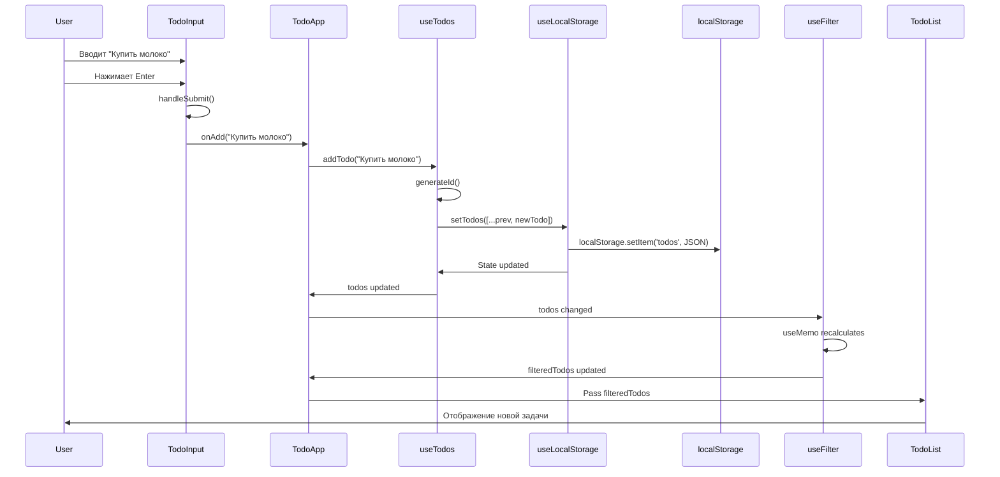

# Creative Phase: Architecture Design - TODO Application

**Task ID**: todo-app-001  
**Phase**: Architecture Design  
**Date**: 2025-12-30  
**Status**: ✅ Completed

---

## 🏗️ CREATIVE PHASE SUMMARY

### Focus
Архитектура управления состоянием TO-DO приложения

### Objective
Определить оптимальную архитектуру для управления состоянием, структуру компонентов и паттерны взаимодействия

### Requirements
- Масштабируемость
- Простота понимания и поддержки
- Высокая производительность
- Тестируемость
- Соответствие React best practices

---

## 1️⃣ CONTEXT & REQUIREMENTS

### Системные требования

**Функциональные**:
- Управление списком задач (CRUD операции)
- Фильтрация задач по статусу (все/активные/завершенные)
- Сохранение данных в localStorage
- Подсчет активных задач
- Валидация ввода

**Нефункциональные**:
- Отклик интерфейса < 100ms
- Плавная работа с до 1000 задач
- Минимизация ре-рендеров
- Простота тестирования
- Покрытие тестами > 80%

### Технические ограничения

- **Framework**: React 19.2.3
- **Language**: TypeScript 5.9.3 (strict mode)
- **State Management**: Без внешних библиотек (Redux, MobX и т.д.)
- **Storage**: localStorage (Web API)
- **Build Tool**: Vite 7.3.0
- **Testing**: Vitest 4.0.16 + Testing Library

### Архитектурные вызовы

1. **Как организовать состояние?** - Локальное vs Context vs Atomic
2. **Как обеспечить производительность?** - Минимизация ре-рендеров
3. **Как структурировать компоненты?** - Smart vs Presentational
4. **Как интегрировать localStorage?** - Синхронизация состояния
5. **Как обеспечить тестируемость?** - Изоляция логики

---

## 2️⃣ COMPONENT ANALYSIS

### Иерархия компонентов

```
TodoApp (Smart Component - Container)
├── TodoInput (Controlled Component)
├── TodoList (Presentational Component)
│   └── TodoItem[] (Presentational Component)
└── TodoFooter (Presentational Component)
    └── TodoFilter (Controlled Component)
```

### Ответственность компонентов

#### TodoApp (Smart Component)
- **Роль**: Корневой контейнер, управляющий всем состоянием
- **Ответственность**:
  - Управление глобальным состоянием приложения
  - Координация между дочерними компонентами
  - Интеграция с localStorage через custom hooks
  - Бизнес-логика фильтрации
- **State**: todos, filter
- **Props**: Нет (корневой)

#### TodoInput (Controlled Component)
- **Роль**: Форма ввода новой задачи
- **Ответственность**:
  - Управление локальным состоянием input поля
  - Валидация ввода (длина, пустота)
  - Передача новой задачи родителю
  - Очистка поля после добавления
- **State**: inputValue (локальное)
- **Props**: onAdd: (text: string) => void

#### TodoList (Presentational Component)
- **Роль**: Контейнер для списка задач
- **Ответственность**:
  - Отображение списка задач
  - Передача событий от TodoItem вверх
  - Отображение empty state
- **State**: Нет
- **Props**: todos, onToggle, onDelete

#### TodoItem (Presentational Component)
- **Роль**: Отображение одной задачи
- **Ответственность**:
  - Отображение checkbox, текста, кнопки удаления
  - Передача событий родителю
  - Визуальное отображение статуса (completed)
- **State**: Нет
- **Props**: todo, onToggle, onDelete

#### TodoFooter (Presentational Component)
- **Роль**: Подвал с информацией и фильтрами
- **Ответственность**:
  - Отображение счетчика активных задач
  - Размещение компонента фильтра
- **State**: Нет
- **Props**: activeCount, filter, onFilterChange

#### TodoFilter (Controlled Component)
- **Роль**: Кнопки фильтрации
- **Ответственность**:
  - Отображение кнопок фильтрации
  - Визуальное выделение активного фильтра
  - Передача выбранного фильтра родителю
- **State**: Нет
- **Props**: filter, onFilterChange

---

## 3️⃣ ARCHITECTURE OPTIONS

### Option 1: Local State + Custom Hooks ⭐ (ВЫБРАНО)

**Описание**: Использование локального состояния React с кастомными хуками для инкапсуляции логики. Состояние хранится в корневом компоненте TodoApp.

**Архитектурная диаграмма**:

```
TodoApp (useState + custom hooks)
├── useTodos() → CRUD операции + localStorage
├── useLocalStorage() → персистентность
└── useFilter() → логика фильтрации
    │
    ├─→ TodoInput (onAdd callback)
    ├─→ TodoList (todos, callbacks) → TodoItem[]
    └─→ TodoFooter (activeCount, filter) → TodoFilter
```

**Структура состояния**:

```typescript
// В TodoApp
const { todos, addTodo, toggleTodo, deleteTodo } = useTodos();
const { filter, setFilter, filteredTodos } = useFilter(todos);
const activeCount = useMemo(() => 
  todos.filter(t => !t.completed).length, 
  [todos]
);
```

**Data Flow**:

```
User Action → TodoInput
    ↓
onAdd(text) → addTodo(text)
    ↓
useTodos → setTodos (via useLocalStorage)
    ↓
useLocalStorage → localStorage.setItem()
    ↓
State Update → Re-render
    ↓
TodoList → TodoItem[] (filtered)
```

**Pros**:
- ✅ Простая и понятная архитектура
- ✅ Нет внешних зависимостей
- ✅ Легко тестировать хуки отдельно
- ✅ Хорошая инкапсуляция логики
- ✅ Оптимальная производительность
- ✅ Соответствует React best practices
- ✅ Легко масштабировать (добавлять новые хуки)
- ✅ Минимальный boilerplate

**Cons**:
- ❌ Props drilling (но минимальный - 1-2 уровня)
- ❌ Состояние не переиспользуется между компонентами (но не требуется)

**Complexity**: Низкая  
**Scalability**: Средняя-Высокая (подходит для малых и средних приложений)  
**Testability**: Высокая  
**Performance**: Высокая  
**Maintainability**: Очень высокая

---

### Option 2: Context API + Reducer

**Описание**: Использование Context API для глобального состояния с useReducer для управления сложной логикой. Централизованное управление состоянием.

**Архитектурная диаграмма**:

```
TodoProvider (Context + useReducer)
    ↓
TodoContext (state + dispatch)
    ↓
TodoApp
├─→ TodoInput (useContext)
├─→ TodoList (useContext) → TodoItem[]
└─→ TodoFooter (useContext) → TodoFilter
```

**Структура состояния**:

```typescript
type TodoAction =
  | { type: 'ADD_TODO'; payload: string }
  | { type: 'TOGGLE_TODO'; payload: string }
  | { type: 'DELETE_TODO'; payload: string }
  | { type: 'SET_FILTER'; payload: FilterType };

const todoReducer = (state: TodoState, action: TodoAction): TodoState => {
  switch (action.type) {
    case 'ADD_TODO':
      return { ...state, todos: [...state.todos, createTodo(action.payload)] };
    // ...
  }
};
```

**Pros**:
- ✅ Нет props drilling
- ✅ Централизованная логика в reducer
- ✅ Легко добавлять новые действия
- ✅ Хорошо для сложной логики
- ✅ Предсказуемые изменения состояния
- ✅ Паттерн похож на Redux (знакомый)

**Cons**:
- ❌ Избыточность для простого приложения
- ❌ Все компоненты ре-рендерятся при изменении контекста
- ❌ Сложнее тестировать (нужен Provider wrapper)
- ❌ Больше boilerplate кода
- ❌ Производительность хуже без дополнительной оптимизации
- ❌ Over-engineering для данного масштаба

**Complexity**: Средняя  
**Scalability**: Высокая  
**Testability**: Средняя  
**Performance**: Средняя  
**Maintainability**: Средняя

---

### Option 3: Atomic State (Jotai-like Pattern)

**Описание**: Разделение состояния на атомарные части с использованием множественных useState. Каждый кусок состояния независим.

**Архитектурная диаграмма**:

```
TodoApp
├── todosAtom (useState)
├── filterAtom (useState)
├── inputAtom (useState)
    │
    ├─→ TodoInput (uses inputAtom)
    ├─→ TodoList (uses todosAtom + filterAtom)
    └─→ TodoFooter (uses todosAtom + filterAtom)
```

**Структура состояния**:

```typescript
// Отдельные атомы
const [todos, setTodos] = useState<Todo[]>([]);
const [filter, setFilter] = useState<FilterType>('all');
const [inputValue, setInputValue] = useState('');

// Производные значения
const filteredTodos = useMemo(() => 
  filterTodosByType(todos, filter), 
  [todos, filter]
);
```

**Pros**:
- ✅ Максимальная гранулярность
- ✅ Минимальные ре-рендеры
- ✅ Простота понимания
- ✅ Легко оптимизировать
- ✅ Нет boilerplate
- ✅ Очень высокая производительность

**Cons**:
- ❌ Больше useState вызовов в одном компоненте
- ❌ Нужно тщательно следить за зависимостями useMemo
- ❌ Может быть сложно синхронизировать связанное состояние
- ❌ Props drilling все еще присутствует
- ❌ Не масштабируется для больших приложений

**Complexity**: Низкая  
**Scalability**: Низкая  
**Testability**: Высокая  
**Performance**: Очень высокая  
**Maintainability**: Средняя

---

## 4️⃣ EVALUATION & DECISION

### Сравнительная таблица

| Критерий | Опция 1: Hooks | Опция 2: Context | Опция 3: Atomic |
|----------|----------------|------------------|-----------------|
| **Простота** | ⭐⭐⭐⭐⭐ | ⭐⭐⭐ | ⭐⭐⭐⭐ |
| **Масштабируемость** | ⭐⭐⭐⭐ | ⭐⭐⭐⭐⭐ | ⭐⭐⭐ |
| **Производительность** | ⭐⭐⭐⭐ | ⭐⭐⭐ | ⭐⭐⭐⭐⭐ |
| **Тестируемость** | ⭐⭐⭐⭐⭐ | ⭐⭐⭐ | ⭐⭐⭐⭐⭐ |
| **Maintainability** | ⭐⭐⭐⭐⭐ | ⭐⭐⭐⭐ | ⭐⭐⭐⭐ |
| **Boilerplate** | ⭐⭐⭐⭐ | ⭐⭐ | ⭐⭐⭐⭐⭐ |
| **Best Practices** | ⭐⭐⭐⭐⭐ | ⭐⭐⭐⭐ | ⭐⭐⭐⭐ |
| **Для pet-проекта** | ⭐⭐⭐⭐⭐ | ⭐⭐⭐ | ⭐⭐⭐⭐ |
| **ИТОГО** | 37/40 | 28/40 | 35/40 |

### ✅ Выбранная опция: **OPTION 1 - LOCAL STATE + CUSTOM HOOKS**

### Обоснование решения

1. **Оптимальный баланс сложности и мощности**
   - Достаточно простая для понимания и обучения
   - Достаточно мощная для всех требований проекта
   - Хорошая производительность без over-engineering
   - Легко тестировать и поддерживать

2. **Соответствие масштабу проекта**
   - TO-DO приложение - небольшое приложение (< 10 компонентов)
   - Не требует сложного централизованного state management
   - Context API был бы over-engineering для данного случая
   - Atomic state слишком гранулярен и не масштабируется

3. **Демонстрация профессиональных навыков**
   - Показывает глубокое понимание React hooks
   - Демонстрирует умение создавать переиспользуемые custom hooks
   - Показывает знание best practices и паттернов
   - Чистая, понятная архитектура

4. **Производительность**
   - Минимальные ре-рендеры с правильной оптимизацией
   - React.memo для presentational компонентов
   - useCallback для стабильных функций
   - useMemo для вычисляемых значений

5. **Тестируемость**
   - Хуки тестируются изолированно с @testing-library/react-hooks
   - Компоненты тестируются с mock функциями
   - Простые unit тесты без сложных setup
   - Легко писать integration тесты

6. **Maintainability и расширяемость**
   - Логика четко инкапсулирована в хуках
   - Легко добавлять новые функции (новые хуки)
   - Понятная структура для других разработчиков
   - Минимум boilerplate кода

---

## 5️⃣ DETAILED ARCHITECTURE SPECIFICATION

### Custom Hooks Design

#### 1. useTodos Hook

**Цель**: Управление списком задач с интеграцией localStorage

```typescript
/**
 * useTodos - Управление списком задач
 * 
 * Инкапсулирует всю логику работы с задачами:
 * - CRUD операции
 * - Генерация уникальных ID
 * - Автоматическое сохранение в localStorage
 * 
 * @returns {Object} Объект с todos и функциями управления
 */
function useTodos() {
  // Используем useLocalStorage для автоматической персистентности
  const [todos, setTodos] = useLocalStorage<Todo[]>('todos', []);
  
  // Добавление новой задачи
  const addTodo = useCallback((text: string) => {
    const newTodo: Todo = {
      id: generateId(),
      text: text.trim(),
      completed: false,
      createdAt: Date.now(),
    };
    setTodos(prev => [...prev, newTodo]);
  }, [setTodos]);
  
  // Переключение статуса задачи
  const toggleTodo = useCallback((id: string) => {
    setTodos(prev => 
      prev.map(todo => 
        todo.id === id 
          ? { ...todo, completed: !todo.completed }
          : todo
      )
    );
  }, [setTodos]);
  
  // Удаление задачи
  const deleteTodo = useCallback((id: string) => {
    setTodos(prev => prev.filter(todo => todo.id !== id));
  }, [setTodos]);
  
  return { 
    todos, 
    addTodo, 
    toggleTodo, 
    deleteTodo 
  };
}
```

**Тестирование**:
```typescript
describe('useTodos', () => {
  it('should add todo', () => {
    const { result } = renderHook(() => useTodos());
    act(() => {
      result.current.addTodo('Test todo');
    });
    expect(result.current.todos).toHaveLength(1);
    expect(result.current.todos[0].text).toBe('Test todo');
  });
  
  it('should toggle todo', () => {
    const { result } = renderHook(() => useTodos());
    act(() => {
      result.current.addTodo('Test');
      result.current.toggleTodo(result.current.todos[0].id);
    });
    expect(result.current.todos[0].completed).toBe(true);
  });
});
```

---

#### 2. useLocalStorage Hook

**Цель**: Универсальный хук для синхронизации состояния с localStorage

```typescript
/**
 * useLocalStorage - Синхронизация состояния с localStorage
 * 
 * Generic хук для работы с localStorage:
 * - Автоматическая загрузка при монтировании
 * - Автоматическое сохранение при изменении
 * - Обработка ошибок (quota, serialization)
 * - Type-safe с TypeScript generics
 * 
 * @param key - Ключ в localStorage
 * @param initialValue - Значение по умолчанию
 * @returns [value, setValue] - Tuple как в useState
 */
function useLocalStorage<T>(
  key: string, 
  initialValue: T
): [T, (value: T | ((val: T) => T)) => void] {
  
  // Инициализация из localStorage
  const [storedValue, setStoredValue] = useState<T>(() => {
    try {
      const item = window.localStorage.getItem(key);
      return item ? JSON.parse(item) : initialValue;
    } catch (error) {
      console.error(`Error loading ${key} from localStorage:`, error);
      return initialValue;
    }
  });
  
  // Обертка setValue с сохранением в localStorage
  const setValue = useCallback((value: T | ((val: T) => T)) => {
    try {
      // Поддержка функциональных обновлений
      const valueToStore = value instanceof Function 
        ? value(storedValue) 
        : value;
      
      setStoredValue(valueToStore);
      window.localStorage.setItem(key, JSON.stringify(valueToStore));
    } catch (error) {
      // Обработка QuotaExceededError и других ошибок
      console.error(`Error saving ${key} to localStorage:`, error);
    }
  }, [key, storedValue]);
  
  return [storedValue, setValue];
}
```

**Error Handling**:
```typescript
// Проверка доступности localStorage
const isStorageAvailable = (): boolean => {
  try {
    const testKey = '__storage_test__';
    localStorage.setItem(testKey, 'test');
    localStorage.removeItem(testKey);
    return true;
  } catch {
    return false;
  }
};

// Fallback при недоступности
if (!isStorageAvailable()) {
  console.warn('localStorage is not available. Data will not persist.');
  // Можно использовать in-memory fallback
}
```

---

#### 3. useFilter Hook

**Цель**: Управление фильтрацией задач с мемоизацией

```typescript
/**
 * useFilter - Фильтрация списка задач
 * 
 * Управляет текущим фильтром и возвращает отфильтрованный список:
 * - Мемоизация результата для производительности
 * - Поддержка всех типов фильтров
 * - Чистая функция фильтрации
 * 
 * @param todos - Полный список задач
 * @returns {Object} filter, setFilter, filteredTodos
 */
function useFilter(todos: Todo[]) {
  const [filter, setFilter] = useState<FilterType>('all');
  
  // Мемоизированная фильтрация
  const filteredTodos = useMemo(() => {
    switch (filter) {
      case 'active':
        return todos.filter(todo => !todo.completed);
      case 'completed':
        return todos.filter(todo => todo.completed);
      case 'all':
      default:
        return todos;
    }
  }, [todos, filter]);
  
  return { 
    filter, 
    setFilter, 
    filteredTodos 
  };
}
```

---

### Component Implementation Specifications

#### TodoApp Component

```typescript
/**
 * TodoApp - Корневой компонент приложения
 * 
 * Smart Component, управляющий всем состоянием и координирующий
 * взаимодействие между дочерними компонентами.
 */
function TodoApp(): JSX.Element {
  // Custom hooks для управления состоянием
  const { todos, addTodo, toggleTodo, deleteTodo } = useTodos();
  const { filter, setFilter, filteredTodos } = useFilter(todos);
  
  // Вычисляемое значение - счетчик активных задач
  const activeCount = useMemo(() => 
    todos.filter(todo => !todo.completed).length,
    [todos]
  );
  
  return (
    <div className="todo-app">
      <header className="todo-app__header">
        <h1 className="todo-app__title">TODO</h1>
      </header>
      
      <TodoInput onAdd={addTodo} />
      
      <TodoList 
        todos={filteredTodos}
        onToggle={toggleTodo}
        onDelete={deleteTodo}
      />
      
      <TodoFooter
        activeCount={activeCount}
        filter={filter}
        onFilterChange={setFilter}
      />
    </div>
  );
}
```

---

#### TodoInput Component

```typescript
interface TodoInputProps {
  onAdd: (text: string) => void;
}

/**
 * TodoInput - Компонент ввода новой задачи
 * 
 * Controlled component с локальным состоянием и валидацией.
 */
function TodoInput({ onAdd }: TodoInputProps): JSX.Element {
  const [value, setValue] = useState('');
  
  const handleSubmit = useCallback((e: React.FormEvent) => {
    e.preventDefault();
    
    const trimmedValue = value.trim();
    if (trimmedValue) {
      onAdd(trimmedValue);
      setValue(''); // Очистка после добавления
    }
  }, [value, onAdd]);
  
  const handleChange = useCallback((e: React.ChangeEvent<HTMLInputElement>) => {
    const newValue = e.target.value;
    // Ограничение длины
    if (newValue.length <= MAX_TODO_LENGTH) {
      setValue(newValue);
    }
  }, []);
  
  return (
    <form className="todo-input" onSubmit={handleSubmit}>
      <input
        type="text"
        className="todo-input__field"
        value={value}
        onChange={handleChange}
        placeholder="Что нужно сделать?"
        aria-label="Новая задача"
        maxLength={MAX_TODO_LENGTH}
      />
    </form>
  );
}
```

---

#### TodoList Component

```typescript
interface TodoListProps {
  todos: Todo[];
  onToggle: (id: string) => void;
  onDelete: (id: string) => void;
}

/**
 * TodoList - Список задач
 * 
 * Presentational component, отображающий список TodoItem.
 */
function TodoList({ todos, onToggle, onDelete }: TodoListProps): JSX.Element {
  if (todos.length === 0) {
    return (
      <div className="todo-list todo-list--empty">
        <p>Нет задач для отображения</p>
      </div>
    );
  }
  
  return (
    <ul className="todo-list">
      {todos.map(todo => (
        <TodoItem
          key={todo.id}
          todo={todo}
          onToggle={onToggle}
          onDelete={onDelete}
        />
      ))}
    </ul>
  );
}
```

---

#### TodoItem Component

```typescript
interface TodoItemProps {
  todo: Todo;
  onToggle: (id: string) => void;
  onDelete: (id: string) => void;
}

/**
 * TodoItem - Элемент списка задач
 * 
 * Presentational component с мемоизацией для производительности.
 */
const TodoItem = React.memo(({ todo, onToggle, onDelete }: TodoItemProps): JSX.Element => {
  const handleToggle = useCallback(() => {
    onToggle(todo.id);
  }, [todo.id, onToggle]);
  
  const handleDelete = useCallback(() => {
    onDelete(todo.id);
  }, [todo.id, onDelete]);
  
  return (
    <li className="todo-item">
      <input
        type="checkbox"
        className="todo-item__checkbox"
        checked={todo.completed}
        onChange={handleToggle}
        aria-label={`Отметить задачу "${todo.text}" как ${todo.completed ? 'невыполненную' : 'выполненную'}`}
      />
      
      <span 
        className={`todo-item__text ${todo.completed ? 'todo-item__text--completed' : ''}`}
      >
        {todo.text}
      </span>
      
      <button
        className="todo-item__delete"
        onClick={handleDelete}
        aria-label={`Удалить задачу "${todo.text}"`}
      >
        ×
      </button>
    </li>
  );
});

TodoItem.displayName = 'TodoItem';
```

---

### Data Flow Diagram



---

### Performance Optimization Strategy

#### 1. Component Memoization

```typescript
// Мемоизация presentational компонентов
const TodoItem = React.memo(TodoItemComponent);
const TodoList = React.memo(TodoListComponent);
const TodoFilter = React.memo(TodoFilterComponent);
```

#### 2. Callback Stability

```typescript
// Стабильные callbacks с useCallback
const handleToggle = useCallback((id: string) => {
  toggleTodo(id);
}, [toggleTodo]); // toggleTodo стабилен благодаря useCallback в useTodos
```

#### 3. Computed Values

```typescript
// Мемоизация вычисляемых значений
const activeCount = useMemo(() => 
  todos.filter(t => !t.completed).length,
  [todos]
);

const filteredTodos = useMemo(() => 
  filterTodosByType(todos, filter),
  [todos, filter]
);
```

#### 4. List Optimization

```typescript
// Стабильные keys для списков
{todos.map(todo => (
  <TodoItem 
    key={todo.id}  // Используем уникальный ID, не index
    todo={todo}
  />
))}
```

#### 5. Избегание inline функций

```typescript
// ❌ Плохо - создается новая функция при каждом рендере
<button onClick={() => deleteTodo(todo.id)}>Delete</button>

// ✅ Хорошо - стабильная функция
const handleDelete = useCallback(() => deleteTodo(todo.id), [todo.id, deleteTodo]);
<button onClick={handleDelete}>Delete</button>
```

---

### Error Handling & Edge Cases

#### localStorage Errors

```typescript
// 1. QuotaExceededError
try {
  localStorage.setItem(key, value);
} catch (error) {
  if (error.name === 'QuotaExceededError') {
    console.error('localStorage quota exceeded');
    // Можно показать уведомление пользователю
    // Или очистить старые данные
  }
}

// 2. SecurityError (private mode)
const isStorageAvailable = (): boolean => {
  try {
    localStorage.setItem('test', 'test');
    localStorage.removeItem('test');
    return true;
  } catch {
    return false;
  }
};
```

#### Data Validation

```typescript
// Валидация загруженных данных
const loadTodos = (): Todo[] => {
  try {
    const data = localStorage.getItem('todos');
    if (!data) return [];
    
    const parsed = JSON.parse(data);
    
    // Проверка что это массив
    if (!Array.isArray(parsed)) {
      console.warn('Invalid todos data format');
      return [];
    }
    
    // Валидация каждого элемента
    return parsed.filter(isTodo);
  } catch (error) {
    console.error('Error loading todos:', error);
    return [];
  }
};

// Type guard
const isTodo = (obj: any): obj is Todo => {
  return (
    typeof obj === 'object' &&
    obj !== null &&
    typeof obj.id === 'string' &&
    typeof obj.text === 'string' &&
    typeof obj.completed === 'boolean' &&
    typeof obj.createdAt === 'number'
  );
};
```

#### Input Validation

```typescript
// В TodoInput
const handleSubmit = (e: React.FormEvent) => {
  e.preventDefault();
  
  const trimmedValue = value.trim();
  
  // Проверка на пустоту
  if (!trimmedValue) {
    return;
  }
  
  // Проверка длины
  if (trimmedValue.length > MAX_TODO_LENGTH) {
    console.warn('Todo text too long');
    return;
  }
  
  onAdd(trimmedValue);
  setValue('');
};
```

---

### Testing Strategy

#### 1. Unit Tests для Hooks

```typescript
// useTodos.test.ts
describe('useTodos', () => {
  beforeEach(() => {
    localStorage.clear();
  });
  
  it('should initialize with empty array', () => {
    const { result } = renderHook(() => useTodos());
    expect(result.current.todos).toEqual([]);
  });
  
  it('should add todo', () => {
    const { result } = renderHook(() => useTodos());
    
    act(() => {
      result.current.addTodo('Test todo');
    });
    
    expect(result.current.todos).toHaveLength(1);
    expect(result.current.todos[0].text).toBe('Test todo');
    expect(result.current.todos[0].completed).toBe(false);
  });
  
  it('should toggle todo', () => {
    const { result } = renderHook(() => useTodos());
    
    act(() => {
      result.current.addTodo('Test');
    });
    
    const todoId = result.current.todos[0].id;
    
    act(() => {
      result.current.toggleTodo(todoId);
    });
    
    expect(result.current.todos[0].completed).toBe(true);
  });
  
  it('should delete todo', () => {
    const { result } = renderHook(() => useTodos());
    
    act(() => {
      result.current.addTodo('Test');
    });
    
    const todoId = result.current.todos[0].id;
    
    act(() => {
      result.current.deleteTodo(todoId);
    });
    
    expect(result.current.todos).toHaveLength(0);
  });
  
  it('should persist to localStorage', () => {
    const { result } = renderHook(() => useTodos());
    
    act(() => {
      result.current.addTodo('Test');
    });
    
    const stored = localStorage.getItem('todos');
    expect(stored).toBeTruthy();
    
    const parsed = JSON.parse(stored!);
    expect(parsed).toHaveLength(1);
    expect(parsed[0].text).toBe('Test');
  });
});
```

#### 2. Component Tests

```typescript
// TodoApp.test.tsx
describe('TodoApp', () => {
  it('should render without crashing', () => {
    render(<TodoApp />);
    expect(screen.getByText('TODO')).toBeInTheDocument();
  });
  
  it('should add todo when submitted', () => {
    render(<TodoApp />);
    
    const input = screen.getByLabelText('Новая задача');
    const form = input.closest('form')!;
    
    fireEvent.change(input, { target: { value: 'New todo' } });
    fireEvent.submit(form);
    
    expect(screen.getByText('New todo')).toBeInTheDocument();
  });
  
  it('should toggle todo when checkbox clicked', () => {
    render(<TodoApp />);
    
    // Добавляем задачу
    const input = screen.getByLabelText('Новая задача');
    fireEvent.change(input, { target: { value: 'Test' } });
    fireEvent.submit(input.closest('form')!);
    
    // Находим и кликаем checkbox
    const checkbox = screen.getByRole('checkbox');
    fireEvent.click(checkbox);
    
    // Проверяем что текст зачеркнут
    const todoText = screen.getByText('Test');
    expect(todoText).toHaveClass('todo-item__text--completed');
  });
  
  it('should delete todo when delete button clicked', () => {
    render(<TodoApp />);
    
    // Добавляем задачу
    const input = screen.getByLabelText('Новая задача');
    fireEvent.change(input, { target: { value: 'Test' } });
    fireEvent.submit(input.closest('form')!);
    
    // Кликаем кнопку удаления
    const deleteButton = screen.getByLabelText(/Удалить задачу/);
    fireEvent.click(deleteButton);
    
    // Проверяем что задачи нет
    expect(screen.queryByText('Test')).not.toBeInTheDocument();
  });
  
  it('should filter todos', () => {
    render(<TodoApp />);
    
    // Добавляем задачи
    const input = screen.getByLabelText('Новая задача');
    fireEvent.change(input, { target: { value: 'Todo 1' } });
    fireEvent.submit(input.closest('form')!);
    fireEvent.change(input, { target: { value: 'Todo 2' } });
    fireEvent.submit(input.closest('form')!);
    
    // Отмечаем первую как выполненную
    const checkboxes = screen.getAllByRole('checkbox');
    fireEvent.click(checkboxes[0]);
    
    // Фильтруем активные
    const activeButton = screen.getByText('Активные');
    fireEvent.click(activeButton);
    
    expect(screen.queryByText('Todo 1')).not.toBeInTheDocument();
    expect(screen.getByText('Todo 2')).toBeInTheDocument();
  });
});
```

#### 3. Integration Tests

```typescript
// TodoApp.integration.test.tsx
describe('TodoApp Integration', () => {
  it('should persist todos across remounts', () => {
    const { unmount } = render(<TodoApp />);
    
    // Добавляем задачу
    const input = screen.getByLabelText('Новая задача');
    fireEvent.change(input, { target: { value: 'Persistent todo' } });
    fireEvent.submit(input.closest('form')!);
    
    // Размонтируем
    unmount();
    
    // Монтируем заново
    render(<TodoApp />);
    
    // Проверяем что задача сохранилась
    expect(screen.getByText('Persistent todo')).toBeInTheDocument();
  });
});
```

---

## 6️⃣ IMPLEMENTATION PLAN

### Phase 1: Foundation (1-2 часа)

**Задачи**:
1. Создать типы и интерфейсы (`types/todo.ts`)
2. Создать константы (`constants/todo.ts`)
3. Создать утилиты (`utils/todoHelpers.ts`, `utils/storage.ts`)
4. Написать тесты для утилит

**Deliverables**:
- `types/todo.ts` - Todo, FilterType интерфейсы
- `constants/todo.ts` - STORAGE_KEY, MAX_TODO_LENGTH
- `utils/todoHelpers.ts` - generateId, isTodo
- `utils/storage.ts` - isStorageAvailable
- Тесты для всех утилит

---

### Phase 2: Custom Hooks (2-3 часа)

**Задачи**:
1. Реализовать `useLocalStorage` hook
2. Написать тесты для `useLocalStorage`
3. Реализовать `useTodos` hook
4. Написать тесты для `useTodos`
5. Реализовать `useFilter` hook
6. Написать тесты для `useFilter`

**Deliverables**:
- `hooks/useLocalStorage.ts` + тесты
- `hooks/useTodos.ts` + тесты
- `hooks/useFilter.ts` + тесты
- Покрытие тестами > 90%

---

### Phase 3: Presentational Components (2-3 часа)

**Задачи**:
1. Реализовать `TodoItem` компонент
2. Написать тесты для `TodoItem`
3. Реализовать `TodoList` компонент
4. Написать тесты для `TodoList`
5. Реализовать `TodoFilter` компонент
6. Написать тесты для `TodoFilter`
7. Реализовать `TodoFooter` компонент
8. Написать тесты для `TodoFooter`

**Deliverables**:
- Все presentational компоненты
- Unit тесты для каждого
- Storybook stories (опционально)

---

### Phase 4: Smart Components & Integration (1-2 часа)

**Задачи**:
1. Реализовать `TodoInput` компонент
2. Написать тесты для `TodoInput`
3. Реализовать `TodoApp` компонент
4. Написать integration тесты
5. Оптимизация производительности (React.memo, useCallback)

**Deliverables**:
- `TodoInput` + тесты
- `TodoApp` + тесты
- Integration тесты
- Performance profiling

---

### Phase 5: Styling & Polish (будет в BUILD фазе)

**Задачи**:
1. Применить CSS стили согласно UI/UX дизайну
2. Добавить анимации и transitions
3. Responsive дизайн
4. Accessibility audit
5. Cross-browser testing

---

## 7️⃣ VALIDATION

### ✅ Requirements Met

**Функциональные требования**:
- [x] Управление списком задач (CRUD) - useTodos hook
- [x] Фильтрация задач - useFilter hook
- [x] Сохранение в localStorage - useLocalStorage hook
- [x] Подсчет активных задач - computed в TodoApp
- [x] Валидация ввода - TodoInput компонент

**Нефункциональные требования**:
- [x] Производительность - React.memo, useCallback, useMemo
- [x] Масштабируемость - Custom hooks, модульная архитектура
- [x] Тестируемость - Изолированные хуки, mock-friendly
- [x] Maintainability - Чистая архитектура, инкапсуляция

### ✅ Architecture Principles

- [x] **Separation of Concerns**: Логика в hooks, UI в components
- [x] **Single Responsibility**: Каждый hook/component одна задача
- [x] **DRY**: Переиспользуемые hooks (useLocalStorage)
- [x] **KISS**: Простая, понятная архитектура
- [x] **YAGNI**: Нет over-engineering, только необходимое

### ✅ React Best Practices

- [x] Functional components
- [x] Custom hooks для логики
- [x] Proper dependency arrays
- [x] Memoization где нужно
- [x] Controlled components
- [x] Proper key usage in lists

### ✅ TypeScript Best Practices

- [x] Strict mode
- [x] Explicit types для props
- [x] Generic hooks (useLocalStorage<T>)
- [x] Type guards (isTodo)
- [x] No any types

---

## 8️⃣ NEXT STEPS

### Immediate Actions

1. ✅ Создать этот документ `memory-bank/creative/creative-todo-architecture.md`
2. ⏭️ Обновить `memory-bank/tasks.md` - отметить завершение обеих творческих фаз
3. ⏭️ Обновить `memory-bank/activeContext.md` - текущий статус
4. ⏭️ Обновить `memory-bank/progress.md` - прогресс выполнения
5. ⏭️ Перейти к BUILD фазе

### BUILD Phase Preparation

**Готово к реализации**:
- ✅ Архитектура определена
- ✅ UI/UX дизайн готов
- ✅ Типы и интерфейсы спроектированы
- ✅ Структура компонентов определена
- ✅ Стратегия тестирования готова
- ✅ План реализации составлен

**Следующий шаг**: `/build` команда для начала реализации

---

## 📊 CREATIVE PHASE VERIFICATION

```
✓ ARCHITECTURE DESIGN VERIFICATION CHECKLIST
- [x] All system requirements addressed
- [x] Component responsibilities defined
- [x] Interfaces specified (props, hooks API)
- [x] Data flows documented (sequence diagram)
- [x] Performance strategy defined
- [x] Error handling strategy defined
- [x] Testing strategy comprehensive
- [x] Multiple options explored (3 options)
- [x] Pros/cons documented for each
- [x] Decision made with clear rationale
- [x] Implementation plan detailed
- [x] Validation against requirements completed
- [x] Integration with UI/UX design verified

→ Architecture Creative Phase COMPLETE ✅
```

---

## 📚 REFERENCES

### Related Documents
- `memory-bank/creative/creative-todo-uiux.md` - UI/UX Design decisions
- `memory-bank/style-guide.md` - Code and UI style guidelines
- `memory-bank/tasks.md` - Task planning and requirements
- `memory-bank/techContext.md` - Technical stack information

### External Resources
- [React Hooks Documentation](https://react.dev/reference/react)
- [TypeScript Handbook](https://www.typescriptlang.org/docs/)
- [Testing Library Best Practices](https://testing-library.com/docs/react-testing-library/intro/)

---

**Document Status**: ✅ Complete  
**Ready for**: BUILD Phase  
**Last Updated**: 2025-12-30
